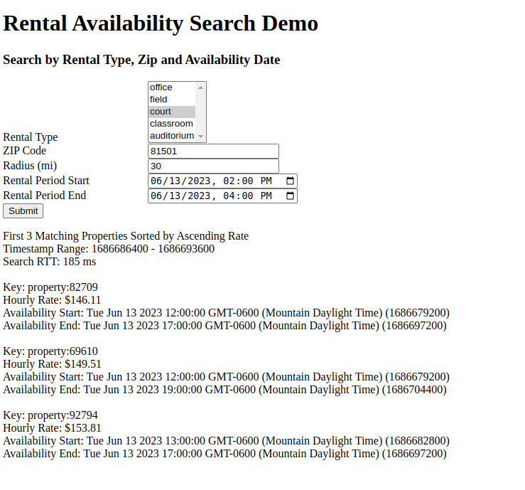
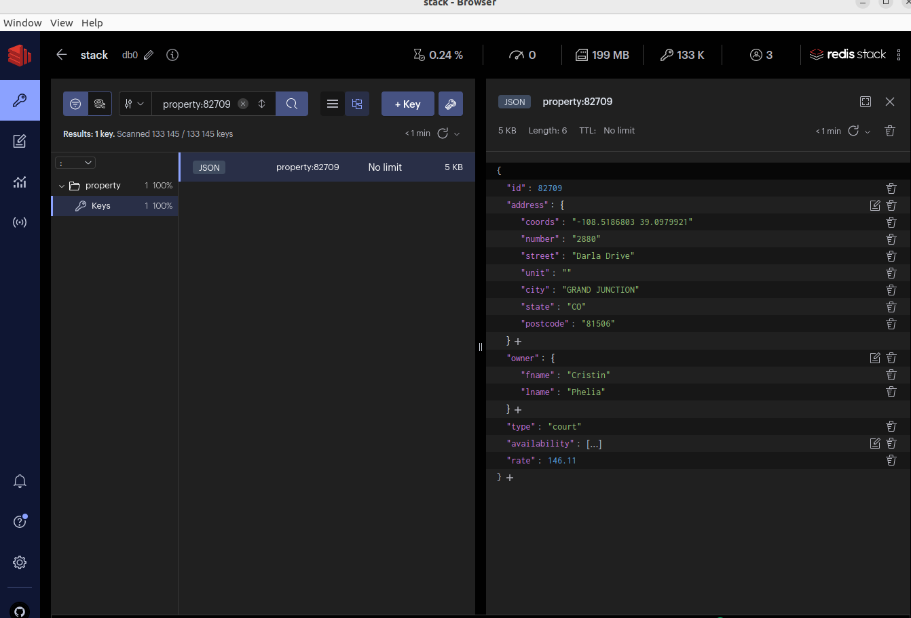

# Redis Rental Availability Demo

## Contents
1.  [Summary](#summary)
2.  [Architecture](#architecture)
3.  [Features](#features)
4.  [Prerequisites](#prerequisites)
5.  [Installation](#installation)
6.  [Usage](#usage)


## Summary <a name="summary"></a>
This is a Javascript-based demo of the Redis Search functionality in property rental domain.  Address data is obtained from a csv file and then supplemented with fictional availability date/time ranges.  

## Architecture <a name="architecture"></a>
  

## Features <a name="features"></a>
- ExpressJS-based REST API server, data loading functionality, and HTML GUI to demonstrate rental availability search.

## Prerequisites <a name="prerequisites"></a>
- Docker
- Docker Compose

## Installation <a name="installation"></a>
```bash
git clone https://github.com/Redislabs-Solution-Architects/rental-availability.git && cd rental-availability
```
Unzip data files in src/data

## Usage <a name="usage"></a>
### Server start-up
```bash
docker compose up -d
```
### Server shutdown
```bash
docker compose down
```
### GUI Access
```bash
http://localhost:8000
```
### Sample GUI Screenshot

### Sample Property Document in RedisInsight



